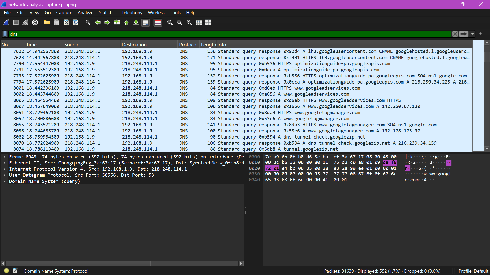
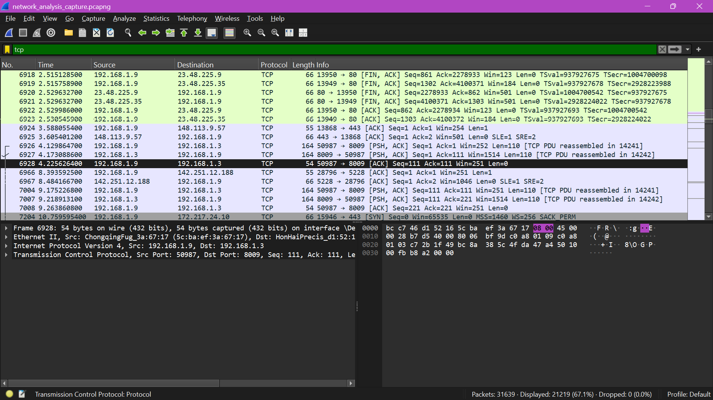

# Elevatelabs-labs-task5-Network-Traffic-Analysis

## Project Overview
This project involves capturing and analyzing live network traffic to understand how data moves across a network. Using Wireshark, I captured real-time packets and performed protocol analysis to isolate and identify common network behaviors, connection types, and communication standards.

---

## Tools Used
* **Wireshark:** Open-source protocol analyzer used for capturing live network packets and applying display filters.
* **Command Prompt / Terminal:** Used to generate localized network traffic via network diagnostics.

---

## Technical Implementation Steps
1. **Environment Setup:** Launched Wireshark and selected the active network interface displaying live traffic spikes.
2. **Traffic Generation:** Opened a web browser to generate web traffic and executed a network ping request to populate the capture log.
3. **Capture Lifecycle:** Allowed the live packet capture to run for approximately one minute before stopping the stream.
4. **Protocol Filtering:** Applied target syntax filters in the display bar to isolate, inspect, and analyze distinct protocols.
5. **Data Export:** Saved the comprehensive traffic capture as a standardized `.pcapng` archive.

---

## Protocol Analysis & Verification

### 1. Domain Name System (DNS)
* **Filter Applied:** `dns`
* **Analysis:** Captured the translation layer resolving domain names into destination IP addresses. The packet details display standard queries and query responses handling application-layer name resolution requests.

### 2. Transmission Control Protocol (TCP)
* **Filter Applied:** `tcp`
* **Analysis:** Isolated core connection-oriented segments. The capture reveals traffic showing structural sequencing, acknowledgment parameters (`ACK`), connection terminations (`FIN`), and the initialization flags governing transport layer data delivery.

### 3. Internet Control Message Protocol (ICMP)
* **Filter Applied:** `icmp`
* **Analysis:** Recorded explicit diagnostic traffic. The capture documents clear "Echo (ping) requests" and corresponding "Echo (ping) replies" confirming reliable end-to-end network layer connectivity.

---

## Interview Questions & Answers

### 1. What is Wireshark used for?
Wireshark is an open-source network protocol analyzer used for capturing, inspecting, and troubleshooting live network traffic in real-time, as well as analyzing pre-recorded packet captures (`.pcap` files).

### 2. What is a packet?
A packet is a small, formatted unit of data sent over a network. Every file, message, or request transmitted across the internet is broken down into these discrete packets, containing a payload (the actual data) and a header (control information like source and destination IP addresses).

### 3. How to filter packets in Wireshark?
Packets can be isolated using **Display Filters** by typing protocol names, IP addresses, or port numbers into the green filter bar at the top of the interface (e.g., `dns`, `tcp`, or `icmp`).

### 4. What is the difference between TCP and UDP?
* **TCP (Transmission Control Protocol):** A connection-oriented protocol that guarantees delivery via error-checking, acknowledgments, and packet sequencing (slower, but highly reliable).
* **UDP (User Datagram Protocol):** A connectionless protocol that broadcasts data rapidly without verifying receipt or maintaining packet order (faster, commonly used for streaming and gaming).

### 5. What is a DNS query packet?
A DNS query packet is a network request sent from a client computer to a DNS server asking to map a human-readable domain name into its corresponding machine-readable numeric IP address.

### 6. How can packet capture help in troubleshooting?
Packet captures provide total visibility into network traffic. It allows engineers to pinpoint where communications fail—such as detecting dropped packets, identifying latency bottlenecks, diagnosing broken protocol handshakes, or uncovering unexpected network traffic patterns indicating a security breach.

### 7. What is a protocol?
A protocol is a standardized, universally accepted set of rules and conventions that dictates how digital devices format, transmit, and receive data across a network cleanly without misinterpretation.

### 8. Can Wireshark decrypt encrypted traffic?
Wireshark cannot automatically decrypt raw encrypted payloads (like standard HTTPS/TLS traffic) right out of the box because it lacks the necessary keys. However, it can decrypt encrypted traffic if you manually feed it the appropriate private cryptographic keys or a session key log file generated by your browser.

---

## Repository Deliverables
* `network_analysis_capture.pcapng` (Raw Packet Capture File)

### DNS Filter View

### TCP Filter View

### ICMP Filter View

---

## 📊 Project Outcome

Through this hands-on task, I successfully captured and isolated live network traffic using Wireshark, demonstrating practical competency in protocol analysis. By filtering and analyzing real-time data packets, I successfully validated three fundamental network communication protocols: **DNS** (application layer name resolution), **TCP** (reliable transport layer streaming), and **ICMP** (network layer diagnostic ping controls). This exercise directly enhanced my foundational skills in packet analysis, network troubleshooting, and security baseline monitoring.
